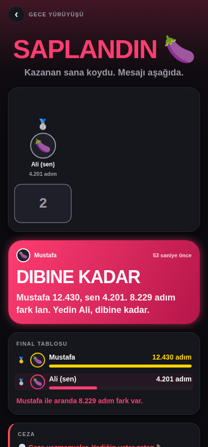
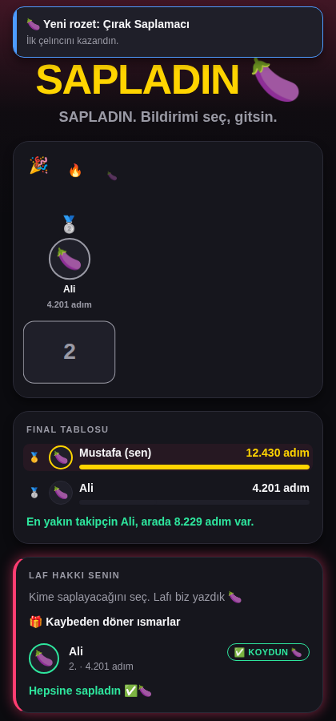
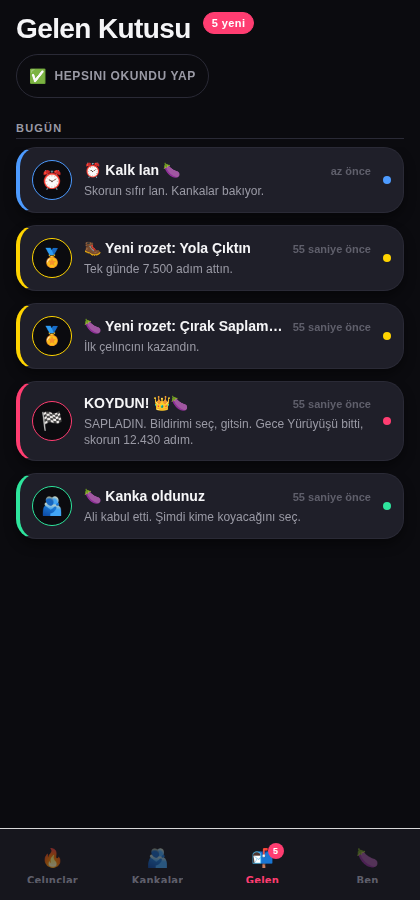

# KOYDUM 🍆

**Arkadaşına koy. Sapır sapır.**

Arkadaşlar arası "çelınc" uygulaması. Bir yarışma açarsın (3 günlük adım yarışı, bir haftalık
odak seansı, sabah 07:00'den önce kalkma...), herkesin skoru sayılır, süre bitince kazanan
**"KOYDUM MU?"** deme hakkını kazanır. Kaybedenlerin telefonuna bildirim düşer:

> **KOYDUM MU?**
> Mustafa sana sapır sapır sapladı 🍆 12.430 adım karşısında 4.201 adım. Yedin Ali.

Ödül kısmı bahane. Asıl mesele laf hakkı. Ve o laf hakkı insanı gerçekten yürütüyor.

Uygulama hem **iOS** hem **Android** için tek koddan çalışır (Expo / React Native).
Arkadaş grubunun kendi sunucusunu çalıştırması yeterli; ortada kayıt olunacak bir şirket yok.

<p align="center">
  
  
  
</p>

<p align="center"><i>Soldan sağa: rezillik ekranı, kazananın laf hakkı, gelen kutusu.
Bu görüntüler uçtan uca test çalışırken gerçek veriyle çekildi (<code>node e2e/smoke.mjs</code>).</i></p>

---

## İçindekiler

1. [Ne var içinde](#ne-var-içinde)
2. [Hızlı başlangıç (5 dakika)](#hızlı-başlangıç-5-dakika)
3. [Telefonda açmak](#telefonda-açmak)
4. [Gerçek uygulama derlemek (EAS)](#gerçek-uygulama-derlemek-eas)
5. [Sunucuyu internete açmak](#sunucuyu-internete-açmak)
6. [Adamlık seviyeleri](#adamlık-seviyeleri)
7. [Çelınc türleri](#çelınc-türleri)
8. [Adım sayımı nasıl çalışıyor](#adım-sayımı-nasıl-çalışıyor)
9. [Proje yapısı](#proje-yapısı)
10. [Geliştirme komutları](#geliştirme-komutları)
11. [Sık karşılaşılan sorunlar](#sık-karşılaşılan-sorunlar)
12. [Testler](#testler)

---

## Ne var içinde

| Klasör | Ne işe yarar |
|---|---|
| `apps/mobile` | Telefon uygulaması. Expo SDK 57, expo-router, TypeScript. |
| `apps/server` | Sunucu. Fastify + SQLite. Tek dosyalık veritabanı, ORM yok. |
| `packages/shared` | İki tarafın da kullandığı tipler, doğrulama şemaları, puanlama, çelınc kataloğu, 84 laf sokma metni ve üç seviyelik arayüz metinleri. |
| `SPEC.md` | Teknik şartname. Veri modeli, API sözleşmesi, ekran listesi. Kod değiştirirken buraya bak. |
| `docs/ARCHITECTURE.md` | Kodun neden böyle bölündüğü: zaman/gün mantığı, çelıncın ömrü, puanlama, laf sokma zinciri. |

Gereksinimler: **Node 20 veya üstü** ve telefonunda **Expo Go** (ya da bir geliştirme derlemesi).

---

## Hızlı başlangıç (5 dakika)

```bash
# 1. Bağımlılıkları kur (bir kere, kökten)
npm install

# 2. Sunucuyu başlat
npm run server
# → KOYDUM server http://0.0.0.0:4000 üzerinde dinliyor
```

Sunucu ilk çalıştığında `apps/server/data/` altında SQLite veritabanını ve bir JWT anahtarı
üretir. Ayar dosyası istersen:

```bash
cp apps/server/.env.example apps/server/.env
```

**Ayrı bir terminalde** uygulamayı başlat:

```bash
npm run mobile
# → QR kod çıkar
```

> `npm run server` kapanmaz, çalışmaya devam eder. İki komutu aynı pencereye yapıştırırsan
> ikincisi hiç çalışmaz. Windows'ta ikinci bir PowerShell penceresi aç, `cd` ile proje
> klasörüne gir, `npm run mobile`'ı orada çalıştır.

Expo Go ile deneyecekseniz, QR kodun üstünde `Using development build` yazıyorsa terminalde
**`s`** tuşuna basıp Expo Go moduna geç; QR kodu ondan sonra okut.

Telefonunla QR kodu okut. Uygulama kendiliğinden bilgisayarının IP adresini bulup sunucuya
bağlanmaya çalışır. Bağlanamazsa giriş ekranındaki **"Sunucu: ... · değiştir"** satırından
adresi elle yazabilirsin (aşağıya bak).

Kayıt ol, arkadaşını da kaydet, arkadaş ekleyin, çelınc açın. Hepsi bu.

---

## Telefonda açmak

### Aynı Wi-Fi ağındaysanız (en kolay yol)

Sunucu `0.0.0.0` üzerinde dinlediği için ağdaki her cihaz erişebilir. Bilgisayarının yerel IP
adresini bul:

```bash
# macOS
ipconfig getifaddr en0
# Linux
hostname -I | awk '{print $1}'
# Windows (PowerShell)
(Get-NetIPAddress -AddressFamily IPv4 | Where-Object {$_.InterfaceAlias -notmatch 'Loopback'}).IPAddress
```

Çıkan adresi (`192.168.1.20` gibi) uygulamadaki **Sunucu adresi** ekranına yaz. Port yazmazsan
otomatik `:4000` eklenir. "Bağlantıyı test et" düğmesi yeşil yanıyorsa tamamdır.

### Arkadaşların farklı ağdaysa

Sunucunun internetten erişilebilir olması gerekir. İki seçenek:

* **Geçici tünel** (test için): `npx localtunnel --port 4000` ya da `cloudflared tunnel --url http://localhost:4000`.
  Çıkan `https://...` adresini uygulamaya yaz.
* **Kalıcı kurulum**: aşağıdaki [Sunucuyu internete açmak](#sunucuyu-internete-açmak) bölümü.

### Expo Go'nun sınırları

Expo Go ile her şey çalışır, iki istisna dışında:

* **Android'de push bildirimi gelmez.** (Expo SDK 53'ten beri böyle.) Uygulama bunu biliyor:
  açıkken uygulama içi bildirim gösterir, kapalıyken arka plan görevi gelen kutusunu kontrol
  edip cihazın kendi bildirimini yaratır. Yani KOYDUM'u yine görürsün, sadece anında değil.
* **Health Connect okunamaz.** Android'de adımlar uygulama açıkken yaklaşık olarak sayılır.

İkisini de düzeltmek için bir geliştirme derlemesi al:

---

## Gerçek uygulama derlemek (EAS)

Push bildirimi, Health Connect ve kendi ikonuyla kurulabilir bir uygulama için:

```bash
npm install -g eas-cli
eas login                       # ücretsiz Expo hesabı
cd apps/mobile
eas init                        # app.json'a extra.eas.projectId yazar
```

Sonra platformuna göre:

```bash
# Android: kurulabilir APK
eas build --profile development --platform android

# iOS: cihazına kurmak için Apple Developer hesabı gerekir
eas build --profile development --platform ios
```

Derleme bitince çıkan bağlantıdan uygulamayı telefonuna kur, sonra `npx expo start --dev-client`
ile bağlan. `preview` profili arkadaşlara dağıtılabilir bir APK, `production` profili mağaza
sürümü üretir.

> **Push için not:** `eas init` çalıştırılmadan `extra.eas.projectId` olmadığı için push token
> alınamaz. Uygulama bunu Ayarlar ekranında açıkça söyler.

---

## Sunucuyu internete açmak

### Docker (en kısa yol)

```bash
docker compose up -d --build
```

Veriler `koydum-data` adlı bir volume'de durur. `PUBLIC_URL` ortam değişkenini dışarıdan
erişilen adrese ayarla, yoksa yüklenen kanıt fotoğraflarının bağlantıları yanlış olur:

```bash
PUBLIC_URL=https://koydum.example.com docker compose up -d
```

### Sunucusuz bir VPS'te

```bash
git clone <bu-depo> && cd koydum
npm ci
PUBLIC_URL=https://koydum.example.com \
DATA_DIR=/var/lib/koydum \
npm start -w apps/server
```

Önüne nginx/Caddy koyup HTTPS ver. Tek dosyalık SQLite veritabanı `DATA_DIR` altında;
yedeklemek için o dosyayı kopyalaman yeterli.

### Ortam değişkenleri

| Değişken | Varsayılan | Açıklama |
|---|---|---|
| `PORT` | `4000` | Dinlenen port |
| `HOST` | `0.0.0.0` | Yerel ağdan erişim için böyle bırak |
| `DATA_DIR` | `./data` | SQLite veritabanı ve JWT anahtarı |
| `UPLOAD_DIR` | `<DATA_DIR>/uploads` | Kanıt fotoğrafları |
| `PUBLIC_URL` | `http://localhost:4000` | Telefonların gördüğü adres |
| `JWT_SECRET` | otomatik üretilir | Elle vermek istersen |
| `EXPO_ACCESS_TOKEN` | boş | Expo push için isteğe bağlı |
| `ENABLE_DEV_ROUTES` | `0` | `1` yaparsan test uçları açılır (üretimde açma) |

---

## Adamlık seviyeleri

Herkes **kendi** tavan seviyesini seçer ve o seviye korunur. Sen 3'te olsan bile, 1'i seçmiş
arkadaşına giden bildirim 1. seviyeye yumuşatılır. Bunu sunucu zorlar, uygulama değil.

| Seviye | Kimin için | Örnek |
|---|---|---|
| **1 — Nazik** | Kırmaz, dalga geçmez. Aile grubu, iş arkadaşı | *"Mustafa kazandı. 12.430 - 4.201 adım. Rövanş düğmesi hemen altta."* |
| **2 — Delikanlı** | Laf sokar, küfretmez. Kanka muhabbeti (varsayılan) | *"Mustafa koydu: 12.430 adım karşısında 4.201. Afiyet olsun Ali."* |
| **3 — Ağır Abi** | Ağzı bozuk, yumuşatmaz. Kaldırabilenler | *"Mustafa sana sapır sapır sapladı 🍆 ... Yedin Ali."* |

Ne yaparsan yap uygulamanın üretmediği şeyler: etnik, dini, cinsiyet, cinsel yönelim veya
engellilik temelli hakaret; tehdit; aile fertlerine küfür. Kullanıcı kendi metnini yazarken de
bu filtre çalışır. Ayrıca herkes birbirini engelleyebilir ve şikayet edebilir.

---

## Çelınc türleri

21 tür var, hepsi telefonda gerçekten ölçülebilir:

| Kategori | Çelınclar |
|---|---|
| **Hareket** | Adım Yarışı 🚶 · Koşu Kilometresi 🏃 · Şınav Kapışması 💪 · Merdiven Canavarı 🪜 |
| **Ekran** | Odak Seansı 🎯 · Ekran Süresi Düellosu 📱 · Sosyal Medya Orucu 🚫 |
| **Uyku** | Erken Kalkan Koyar 🌅 · Erken Yatma Sözü 🌙 |
| **Beslenme** | Su Bardağı Yarışı 💧 · Şekersiz Günler 🍬 · Fast Food Boykotu 🍔 · Yeşillik Kotası 🥦 |
| **Zihin** | Sayfa Avcısı 📚 · Dil Pratiği Dakikası 🔤 · Günlük Defteri 📝 |
| **Kötü alışkanlık** | Dumansız Günler 🚭 · Ayık Kalma Yarışı 🍺 · Tırnak Yemeyen Koyar 💅 |
| **Diğer** | Soğuk Duş Kahramanı 🥶 · Yatak Toplama Sabahı 🛌 |

Ölçüm altı yöntemden birine oturur:

* **Otomatik adım** — telefonun adım sayacı, elle giriş yok.
* **Odak dakikası** — uygulama içi sayaç; uygulamadan çıkarsan seans yanar.
* **Saatli check-in** — belirlenen saatten önce "GELDİM" demen gerekir, saati sunucu doğrular.
* **Sayı girişi** — bardak, sayfa, km, tekrar. İsteğe bağlı fotoğraf kanıtı.
* **Az olan kazanır** — ekran süresi gibi; girmediğin gün en kötü değerden sayılır.
* **Günlük evet/hayır** — sigara içmedim, şeker yemedim. Gün sayısı yarışır.

Her türün "hile olur mu?" notu uygulamanın içinde yazılı. Şüpheli girişlere arkadaşlar **itiraz**
edebilir; yeterli itiraz gelirse o giriş silinir.

---

## Adım sayımı nasıl çalışıyor

| Platform | Kaynak | Not |
|---|---|---|
| **iOS** | Core Motion (`Pedometer.getStepCountAsync`) | Son 7 günün geçmişi cihazda durur. Uygulamayı hiç açmasan da adımların sayılır; haftada bir açman yeter. |
| **Android + Health Connect** | `react-native-health-connect` | Kesin günlük toplam. Geliştirme derlemesi ve Health Connect'e veri yazan bir uygulama (Samsung Health, Google Fit, Fitbit) gerekir. |
| **Android, Health Connect yoksa** | `Pedometer.watchStepCount` | Sadece uygulama açıkken sayar, cihazda birikir. Uygulama bunu "yaklaşık" diye açıkça işaretler. |
| **Web** | yok | Web derlemesi test amaçlıdır; adım gösterilmez. |

Android 10 ve üstünde adım sayacını okumak için **Fiziksel Aktivite** izni gerekiyor. Uygulama
bunu adım saymaya başlamadan önce istiyor; vermezsen ayarlar ekranı "izin verilmedi" der.
İzni sormadan saymaya kalkan bir uygulama sıfır sayar ve bozuk görünür.

Adımlar sunucuya günlük özet olarak gider (`POST /me/steps`), ham konum veya sensör verisi
asla gönderilmez. Uygulama açıldığında, ön plana geldiğinde ve arka plan görevinde
(15 dakikada bir, platformun izin verdiği ölçüde) senkronize olur.

### Ekran süresi neden elle giriliyor?

Kısa cevap: **iPhone'da başka yolu yok.**

* **iOS:** Ekran Süresi verisini üçüncü parti bir uygulama okuyamaz. Apple'ın Family Controls /
  DeviceActivity çerçevesi özel bir yetki istiyor ve o yetkiyle bile rakamlar uygulamanın
  erişemediği bir kutunun içinde kalıyor — sunucuya göndermek zaten tasarım gereği mümkün değil.
  Bu Expo'nun eksiği değil, Apple'ın kararı.
* **Android:** Mümkün. `UsageStatsManager` günlük ekran süresini veriyor, ama kullanıcının sistem
  ayarlarından "kullanım erişimi" izni vermesi ve uygulamanın gerçek bir derleme olması gerekiyor
  (Expo Go'da çalışmaz).

`apps/mobile/src/services/screenTime.ts` bu boşluğu dürüstçe yönetiyor: yerel modülü **adıyla**
arıyor (`requireOptionalNativeModule`), bulamazsa `needs-native-module` diyor ve uygulama elle
girişe düşüyor. Android tarafını açmak isteyen bir `KoydumScreenTime` yerel modülü eklediğinde
başka hiçbir yeri değiştirmesi gerekmiyor.

---

## Proje yapısı

```
koydum/
├── apps/
│   ├── mobile/            Expo uygulaması
│   │   ├── src/app/       expo-router rotaları (dosya = ekran)
│   │   ├── src/components/ tasarım sistemi
│   │   ├── src/services/  adım, bildirim, odak, arka plan
│   │   ├── src/hooks/     react-query sorguları
│   │   └── assets/brand/  ikon, splash, favicon
│   └── server/
│       ├── src/routes/    HTTP uçları
│       ├── src/services/  çelınc yaşam döngüsü, bildirim, push
│       └── src/db/        şema ve göçler
├── packages/shared/       tipler, şemalar, puanlama, katalog, laflar
├── SPEC.md                teknik şartname
├── Dockerfile
└── docker-compose.yml
```

---

## Geliştirme komutları

```bash
npm run server        # sunucuyu geliştirme modunda çalıştır (dosya değişince yeniden başlar)
npm run mobile        # Expo geliştirme sunucusu
npm run mobile:clear  # aynısı, Metro önbelleğini temizleyerek
npm run typecheck     # bütün paketlerde TypeScript kontrolü
npm test              # bütün testler

# Tek tek
npm test -w packages/shared
npm test -w apps/server
cd apps/mobile && npx jest
cd apps/mobile && npx expo export --platform web   # tarayıcıda hızlı deneme
```

---

## Sık karşılaşılan sorunlar

**"Sunucuya ulaşamadım" diyor.**
Telefon ile bilgisayar aynı Wi-Fi'da mı? Bilgisayarın güvenlik duvarı 4000 portunu kapatıyor
olabilir. Sunucu adresini elle yazıp "Bağlantıyı test et" ile dene.

**Android'de bildirim gelmiyor.**
Expo Go kullanıyorsan normal — yukarıdaki [Expo Go'nun sınırları](#expo-gonun-sınırları)
bölümüne bak. Geliştirme derlemesi al ve `eas init` çalıştırdığından emin ol. Ayarlar
ekranı hangi aşamada takıldığını Türkçe olarak söyler.

**Adımlar 0 görünüyor.**
iOS'ta hareket izni verilmemiş olabilir (Ayarlar → Gizlilik → Hareket ve Fitness). Android'de
Health Connect kurulu değilse uygulama yaklaşık sayıma düşer ve bunu ekranda yazar.

**Uygulama açılmıyor, kırmızı hata ekranı geliyor.**
Depoyu güncelle (`git pull`) ve Metro önbelleğini temizleyerek başlat:
`npm run mobile:clear`. Eski bir sürümde Expo Go/Android'de `expo-notifications`
yüklenirken patlıyordu ve bütün uygulamayı düşürüyordu; artık bildirim modülü ayrı ayrı
yükleniyor, gelmezse uygulama onsuz devam ediyor.

**Çelınc bitti ama sonuç çıkmadı.**
Sonuçlandırmayı sunucudaki zamanlayıcı yapar ve 30 saniyede bir çalışır. Sunucu kapalıysa
açıldığında geçmiş çelınclarını da kapatır.

**Saat farkı.**
Günler kullanıcının kendi saat dilimine göre hesaplanır. Yurt dışına çıkarsan Ayarlar
ekranındaki "cihazdan güncelle" düğmesine bas.

---

## Testler

```bash
npm run typecheck     # üç paketin tamamı
npm test              # ortak paket + sunucu
cd apps/mobile && npx jest
node e2e/smoke.mjs    # gerçek sunucu + tarayıcı, uçtan uca (playwright-core ister)
```

`e2e/smoke.mjs` geçici bir veritabanıyla sunucuyu ayağa kaldırır, iki kullanıcı kaydeder,
aralarında bir adım çelıncı oynatır, çelıncı kapatır, KOYDUM gönderir; sonra web derlemesini
Chromium'da açıp giriş, ana sayfa, rezillik ekranı, kazanan ekranı ve gelen kutusunu doğrular ve
`docs/screens/` altındaki görüntüleri yeniler.

`apps/server/test/contract.test.ts` uygulamanın çağırdığı her ucun **çalışma zamanı şeklini**
doğrular. Sunucu bir gün diziyi nesneye çevirirse test orada patlar, telefonda değil.

---

## Lisans

Kişisel kullanım için. Arkadaşlarınla yarış, kimseyi kırma, yürü.
