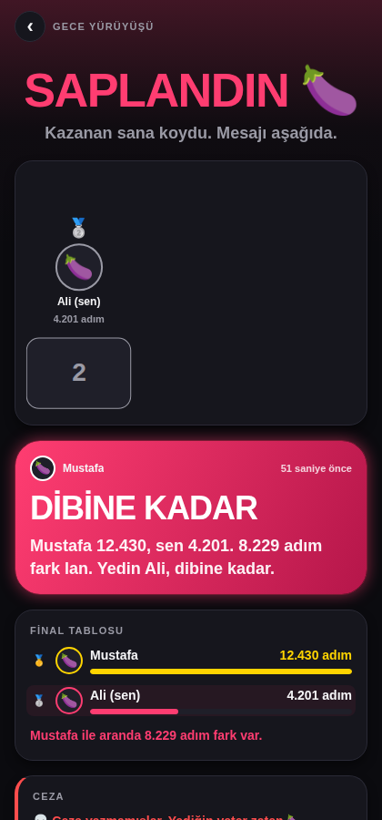
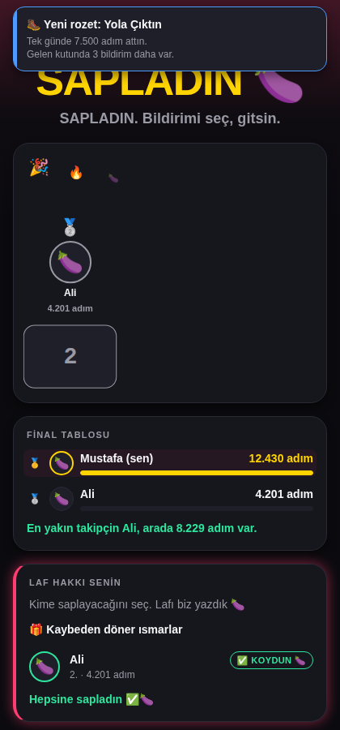
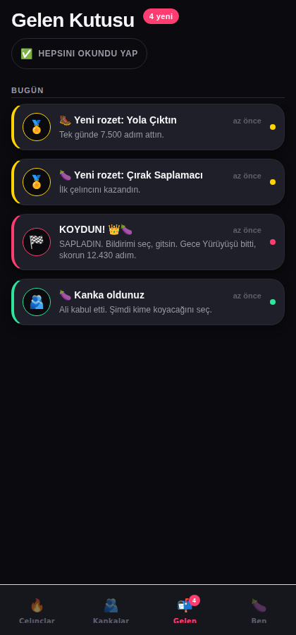

# KOYDUM 🍆

**Arkadaşına koy. Sapır sapır.**

Arkadaşlar arası "çelınc" uygulaması. Bir yarışma açarsın (3 günlük adım yarışı, bir haftalık
odak seansı, sabah 07:00'den önce kalkma...), herkesin skoru sayılır, süre bitince kazanan
**"KOYDUM MU?"** deme hakkını kazanır. Kaybedenlerin telefonuna bildirim düşer:

> **KOYDUM MU?**
> Mustafa sana sapır sapır sapladı 🍆 12.430 adım karşısında 4.201 adım. Yedin Ali.

Ödül kısmı bahane. Asıl mesele laf hakkı. Ve o laf hakkı insanı gerçekten yürütüyor.

Uygulama hem **iOS** hem **Android** için tek koddan çalışır (Expo / React Native).
Arkadaş grubunun kendi sunucusunu çalıştırması yeterli; ortada kayıt olunacak bir şirket yok.

<p align="center">
  
  
  
</p>

<p align="center"><i>Soldan sağa: rezillik ekranı, kazananın laf hakkı, gelen kutusu.
Bu görüntüler uçtan uca test çalışırken gerçek veriyle çekildi (<code>node e2e/smoke.mjs</code>).</i></p>

---

## İçindekiler

1. [Ne var içinde](#ne-var-içinde)
2. [Hızlı başlangıç (5 dakika)](#hızlı-başlangıç-5-dakika)
3. [Telefonda açmak](#telefonda-açmak)
4. [APK yapıp arkadaşına göndermek](#apk-yapıp-arkadaşına-göndermek)
5. [Sunucuyu internete açmak](#sunucuyu-internete-açmak)
6. [Yönetim komutları](#yönetim-komutları)
7. [Adamlık seviyeleri](#adamlık-seviyeleri)
8. [Çelınc türleri](#çelınc-türleri)
9. [Adım sayımı nasıl çalışıyor](#adım-sayımı-nasıl-çalışıyor)
10. [Proje yapısı](#proje-yapısı)
11. [Geliştirme komutları](#geliştirme-komutları)
12. [Sık karşılaşılan sorunlar](#sık-karşılaşılan-sorunlar)
13. [Testler](#testler)

---

## Ne var içinde

| Klasör | Ne işe yarar |
|---|---|
| `apps/mobile` | Telefon uygulaması. Expo SDK 57, expo-router, TypeScript. |
| `apps/server` | Sunucu. Fastify + SQLite. Tek dosyalık veritabanı, ORM yok. |
| `packages/shared` | İki tarafın da kullandığı tipler, doğrulama şemaları, puanlama, çelınc kataloğu, 84 laf sokma metni ve üç seviyelik arayüz metinleri. |
| `SPEC.md` | Teknik şartname. Veri modeli, API sözleşmesi, ekran listesi. Kod değiştirirken buraya bak. |
| `docs/ARCHITECTURE.md` | Kodun neden böyle bölündüğü: zaman/gün mantığı, çelıncın ömrü, puanlama, laf sokma zinciri. |

Gereksinimler: **Node 20 veya üstü** ve telefonunda **Expo Go** (ya da bir geliştirme derlemesi).

---

## Hızlı başlangıç (5 dakika)

```bash
# 1. Bağımlılıkları kur (bir kere, kökten)
npm install

# 2. Sunucuyu başlat
npm run server
# → KOYDUM server http://0.0.0.0:4000 üzerinde dinliyor
```

Sunucu ilk çalıştığında `apps/server/data/` altında SQLite veritabanını ve bir JWT anahtarı
üretir. Bir ayarı değiştirmek istersen (mesela portu), örnek dosyayı kopyalayıp Not Defteri'nde
aç:

```powershell
copy apps\server\.env.example apps\server\.env
notepad apps\server\.env
```

`npm run server`, `npm run internet`, `npm run yonet` ve `npm run apk:yayinla` bu dosyayı
açılırken okur; bir şey değiştirdiysen sunucuyu kapatıp aç. PowerShell'de elle verdiğin bir
değer (`$env:PORT=5000`) dosyadakinden önce gelir.

**Ayrı bir terminalde** uygulamayı başlat:

```bash
npm run mobile
# → QR kod çıkar
```

> `npm run server` kapanmaz, çalışmaya devam eder. İki komutu aynı pencereye yapıştırırsan
> ikincisi hiç çalışmaz. Windows'ta ikinci bir PowerShell penceresi aç, `cd` ile proje
> klasörüne gir, `npm run mobile`'ı orada çalıştır.

Expo Go ile deneyecekseniz, QR kodun üstünde `Using development build` yazıyorsa terminalde
**`s`** tuşuna basıp Expo Go moduna geç; QR kodu ondan sonra okut.

Telefonunla QR kodu okut. Uygulama kendiliğinden bilgisayarının IP adresini bulup sunucuya
bağlanmaya çalışır. Bağlanamazsa giriş ekranındaki **"Sunucu: ... · değiştir"** satırından
adresi elle yazabilirsin (aşağıya bak).

Kayıt ol, arkadaşını da kaydet, arkadaş ekleyin, çelınc açın. Hepsi bu.

---

## Telefonda açmak

### Aynı Wi-Fi ağındaysanız (en kolay yol)

Sunucu `0.0.0.0` üzerinde dinlediği için ağdaki her cihaz erişebilir. Bilgisayarının yerel IP
adresini bul:

```bash
# macOS
ipconfig getifaddr en0
# Linux
hostname -I | awk '{print $1}'
# Windows (PowerShell)
(Get-NetIPAddress -AddressFamily IPv4 | Where-Object {$_.InterfaceAlias -notmatch 'Loopback'}).IPAddress
```

Çıkan adresi (`192.168.1.20` gibi) uygulamadaki **Sunucu adresi** ekranına yaz. Port yazmazsan
otomatik `:4000` eklenir. "Bağlantıyı test et" düğmesi yeşil yanıyorsa tamamdır. APK'yı yeni kurmuş
bir telefonda giriş ekranının en üstünde **Önce sunucuyu seç** kartı çıkar; adresi oraya da
yazabilirsin.

### Arkadaşların farklı ağdaysa: `npm run internet`

Sunucunun internetten erişilebilir olması gerekir. En kısa yol tek komut; ücretsiz, hesap
açmak ya da modemden port açmak gerekmiyor.

**Bir kere:** Cloudflare'in tünel programını kur. PowerShell'de:

```powershell
winget install --id Cloudflare.cloudflared
```

Kurduktan sonra PowerShell'i kapatıp yeniden aç.

**Her oynamak istediğinde**, `npm run server` yerine:

```powershell
cd C:\Users\ArisK\koydum
npm run internet
```

Birkaç saniye sonra ekranda şuna benzer bir satır çıkar:

```
✓ KOYDUM internette:  https://tatli-kelimeler-burada.trycloudflare.com
```

Bundan sonra uygulamada **Kankalar → Paylaş** bu adresle bağlantı gönderir. Başka şehirdeki
kankan bağlantıya dokunur, uygulama o adrese bağlanır, kanka isteğini gönderir. Senin telefonun
evdeki Wi-Fi'da kalabilir; aynı sunucudur.

Bilinmesi gerekenler:

* **Pencere açık kaldıkça çalışır.** Bilgisayar uyursa ya da pencereyi kapatırsan kankaların
  bağlanamaz; çelınc sonuçları sunucu tekrar açılınca hesaplanır. Kapatırken **Ctrl+C**'ye bas:
  sunucu elindeki bildirimleri bitirip veritabanını düzgünce kapatır.
* **Sunucu çökerse pencere onu kendisi yeniden açar.** "Sunucu düştü, yeniden açıyorum" yazar,
  birkaç saniye sonra sunucu geri gelir. Tünel yerinde kaldığı için adres de aynıdır, kimseye
  yeni bağlantı atmana gerek yok. On dakikada beş kere çökerse bırakır ve kapanır; sebebi hemen
  üstündeki hatada yazar.
* **İnternet giderse tünel kopar, sunucu kapanmaz.** Pencerede "Tünel koptu (internet gitmiş
  olabilir), tekrar deniyorum" yazar. Evdeki Wi-Fi'dan bağlananlar oynamaya devam eder; pencere
  internet gelene kadar tüneli yeniden dener (en seyrek dakikada bir). Tünel geri gelince adres
  çoğu zaman değişir: pencerede yeni adres ve "Yeni adres: Kankalar > Paylaş ile gruba tekrar
  at." yazar, dediğini yap.
* **Pencereyi kapatıp açınca adres değişir.** Paylaş'la yeni bağlantıyı gönder. Kankan
  yeni bağlantıya dokununca uygulama "Bu davet yeni bir adresten" der; **Yeni adrese geç (çıkış
  yok)**'a basar, o kadar. Çıkış yapmaz, şifre yazmaz; hesabı, çelıncları ve bildirimleri
  yerindedir. Bağlantıyı başka yerden gören kankan **Ayarlar → Sunucu**'ya yeni adresi ya da
  bağlantının kendisini yapıştırır, aynısı olur. Uygulama adres değişse de aynı sunucu olduğunu
  anlar: yeni adres, oturumu taşımadan önce JWT anahtarını (`apps/server/data/secret`) bildiğini
  kanıtlamak zorundadır, kanıtlayamayan bir adrese oturum gitmez. O dosyayı silmedikçe kimse
  dışarı atılmaz.
* **Uygulaması eski sürüm (1.0) olan** kankanda bu ekran yok: bağlantıdaki **KOYDUM'da aç** ona
  boş bir sayfa açar. En kolayı aynı sayfadaki **Uygulamayı indir (Android)** ile yeni sürümü
  eskisinin üstüne kurması (hesabı kalır), sonra bağlantıya tekrar dokunup **Yeni adrese geç
  (çıkış yok)** demesi; bir daha da gerekmez. Kurmak istemezse eski uygulamada **Ayarlar →
  Sunucu → Çıkış yap ve değiştir** (ya da kırmızı **Adresi düzelt →** şeridi) der, sayfanın
  **Sunucu** satırındaki adresi başına `https://` koyarak yazar (`/davet/…` kısmı olmadan) ve
  aynı kullanıcı adı ve şifreyle girer.

Sabit bir adres ve 7/24 açık bir sunucu istersen aşağıdaki
[Sunucuyu internete açmak](#sunucuyu-internete-açmak) bölümüne bak.

### Expo Go'nun sınırları

Expo Go ile her şey çalışır, iki istisna dışında:

* **Android'de push bildirimi gelmez.** (Expo SDK 53'ten beri böyle.) Uygulama bunu biliyor:
  açıkken uygulama içi bildirim gösterir, kapalıyken arka plan görevi gelen kutusunu kontrol
  edip cihazın kendi bildirimini yaratır. Yani KOYDUM'u yine görürsün, sadece anında değil.
* **Health Connect okunamaz.** Android'de adımlar uygulama açıkken yaklaşık olarak sayılır.

İkisini de düzeltmek için bir geliştirme derlemesi al:

---

## APK yapıp arkadaşına göndermek

Evet, olur. İki ayrı iş var ve **asıl mesele ikincisi**.

### 1. APK

```bash
npm install -g eas-cli
eas login                       # ücretsiz Expo hesabı
cd apps/mobile
eas init                        # app.json'a extra.eas.projectId yazar (push için şart)
eas build --profile preview --platform android
```

Derleme Expo'nun sunucularında yapılır (ücretsiz kuyrukta 10-30 dakika sürebilir). Bitince bir
indirme bağlantısı verir: `.apk` dosyasını indir, WhatsApp'tan, Drive'dan, nereden istersen
gönder. Arkadaşın kurarken Android "bilinmeyen kaynak" uyarısı verir, bir kere izin vermesi
yeterli.

`preview` profili bilerek **uygulama içi sunucu adresi ekranını açık bırakır** — arkadaşın
uygulamayı açtığında adresi kendisi yazabilir. Henüz sunucu seçilmemişse giriş ve kayıt ekranları
en üstte **Önce sunucuyu seç** der ve sunucu seçilene kadar giriş düğmesine basılamaz; arkadaşın
senin attığın davet mesajını olduğu gibi yapıştırır, sunucu da davet kodu da oradan okunur.
`production` profili adresi derlemeye gömer ve o ekranı gizler; onu kullanacaksan
`apps/mobile/eas.json` içindeki `EXPO_PUBLIC_KOYDUM_API_URL` değerini **önce kendi adresinle
değiştir**, yoksa açılmayan bir sunucuya bakan bir uygulama çıkar.

> **Düz HTTP hakkında:** Android 9'dan beri şifresiz `http://` bağlantıları varsayılan olarak
> engelli. Bu uygulama kendi sunucusuna bağlanmak zorunda ve o sunucu çoğu zaman ev ağındaki bir
> IP adresinde (`http://192.168.1.x:4000`) duruyor, o yüzden `app.json` içinde
> `usesCleartextTraffic: true` açık. Sunucunu gerçek bir alan adına ve HTTPS'e taşıdığında bunu
> kapatabilirsin.

> **iPhone:** Bir arkadaşının iPhone'una kurmak için Apple Developer hesabı ($99/yıl) ve
> TestFlight gerekiyor. Apple'ın kuralı, bunu aşmanın yolu yok. Android tarafında böyle bir
> engel yok.

### 1b. Güncellemeleri APK indirmeden almak (EAS Update)

Uygulamada `expo-updates` kurulu. Bunun anlamı: **JavaScript'e dokunan her düzeltme** (metin,
ekran, kural, rozet, laf) kurulu telefonlara **yeniden derlemeden** gider. Derleme yalnızca yerel
tarafa dokunan değişikliklerde gerekir (yeni bir native paket, `app.json`'daki izinler, ikon).

Bir düzeltmeyi yaymak için:

```bash
cd apps/mobile
eas update --channel preview --message "berabere metni düzeldi"
```

Bir dakika sürer. `preview` kanalındaki her kurulu uygulama (APK ya da Play iç testi) bir sonraki
açılışta yeni sürümü alır. Kanal, `eas.json`'daki profilde yazıyor; `play-internal` profili de
`preview` kanalını dinler, yani tek komut ikisine birden gider.

Kural: `app.json`'daki `version` değeri, uygulamanın "çalışma zamanı"dır (`runtimeVersion:
appVersion`). Yerel tarafı değiştiren bir derleme yaptığında `version`'ı yükselt (1.0.0 → 1.1.0),
böylece eski kurulumlar kendilerinde olmayan native kodu varsayan bir güncelleme almaz.
Ekran süresi modülü tam olarak böyle bir değişiklikti: 1.1.0 sürümü yeni bir APK ister, `eas update`
ile 1.0.0 kurulumlarına gitmez.

### 1c. Google Play'e gizli olarak koymak (dahili test)

Play'de "gizli uygulama" diye bir şey var, adı **Internal testing**. Mağazada listelenmez,
aramada çıkmaz; sadece senin eklediğin e-postalar (en fazla 100 kişi) ya da verdiğin bağlantıyla
kurulur ve **güncellemeler Play üzerinden** normal bir uygulama gibi gelir. Piyasaya çıkmadan
arkadaşlarla denemek için tam olarak bu.

Bir kerelik işler:

1. **Google Play Console** hesabı aç: [play.google.com/console](https://play.google.com/console) —
   25 $ tek seferlik ücret ve kimlik doğrulaması (birkaç gün sürebilir).
2. Console'da **Create app** → adı KOYDUM, uygulama, ücretsiz.
3. Derlemeyi mağaza formatında (AAB) al:
   ```bash
   cd apps/mobile
   eas build --profile play-internal --platform android
   ```
   Bu profil `preview` ile aynıdır, sadece APK yerine AAB üretir ve sürüm numarasını her seferinde
   otomatik artırır. Uygulama içi sunucu adresi ekranı açık kalır.
4. Console'da **Testing → Internal testing → Create new release**, indirdiğin `.aab` dosyasını
   yükle, kaydet, yayınla. İlk yüklemede Play imzalama anahtarını kendisinin yönetmesini kabul et.
5. Aynı sayfada **Testers** sekmesinden bir liste oluştur, arkadaşlarının Gmail adreslerini ekle.
   **Copy link** ile çıkan bağlantıyı onlara gönder; bağlantıya girip "Become a tester" deyince
   uygulama Play'de görünür ve kurulur.

Sonraki her sürümde sadece 3. ve 4. adım. (`eas submit -p android` ile 4. adımı da otomatiğe
bağlayabilirsin; bunun için Console'dan bir servis hesabı anahtarı gerekiyor, README'nin bu
kısmını ona göre genişletiriz.)

İki şey bilinsin:

* Google, yeni kişisel geliştirici hesaplarının **mağazaya (production) çıkmadan önce** en az 12
  kişiyle 14 gün kapalı test yapmasını istiyor. Dahili test için böyle bir şart yok — o hemen
  çalışır. Zaten sizin yapacağınız şey de bu.
* Play'den kurmak sunucu sorununu çözmez. Arkadaşların uygulamayı Play'den de alsa, uygulamanın
  konuşacağı bir KOYDUM sunucusu olmak zorunda — aşağıdaki bölüm.

### 1d. Davet bağlantısı ve APK'yı sunucudan dağıtmak

Kankalar sekmesindeki **Paylaş** artık bir bağlantı gönderir: `http://<sunucu>/davet/ABC123`.
Arkadaşın bağlantıya dokununca sunucunun kendi sayfası açılır:

* "Mustafa seni KOYDUM'a çağırıyor" yazar (WhatsApp önizlemesinde de görünür),
* **KOYDUM'da aç** uygulamayı açar ve sunucu adresini uygulamaya kendisi verir; arkadaşın IP yazmaz,
* uygulama yoksa aynı sayfadan APK indirilir,
* kurulum bitince Android'in kendi **Aç** düğmesine basan arkadaşın uygulamayı bağlantısız açar;
  sayfadaki **Bağlantıyı kopyala** bunun için var. Uygulama giriş ekranında **Önce sunucuyu seç**
  der, arkadaşın kopyaladığı bağlantıyı (ya da WhatsApp mesajının tamamını) oraya yapıştırır.
  Bu kart bir sonraki `eas build` ile gelir; ondan önceki APK'da arkadaşın giriş ekranının
  altındaki **Sunucu: localhost:4000 · değiştir**'e basıp sadece adresi yazar (`/davet/…` kısmı
  olmadan),
* kayıt olunca kanka isteği kendiliğinden gider.

APK'yı sunucuya koymak için expo.dev'den indirdiğin dosyayı bir kere yayınla:

```bash
npm run apk:yayinla -- C:\Users\sen\Downloads\koydum.apk
# sürümü app.json'dan okur; elle vermek istersen: -- dosya.apk --surum 1.1.0 --not "Ekran süresi geldi"
```

Dosya `apps/server/data/app/koydum.apk` olarak durur, sunucu yeniden başlatmadan `/koydum.apk`
adresinden sunar. APK'yı başka yerde tutuyorsan (expo.dev derleme sayfası gibi) sunucuya
`APP_DOWNLOAD_URL` ve `APP_LATEST_VERSION` ortam değişkenlerini ver, sayfa oraya yönlendirir.

APK'nın boyu burada önemli: arkadaşların onu çoğu zaman mobil veriyle, senin evdeki internetinin
yükleme hızından indiriyor ve indirme sürerken sunucu herkese ağırlaşıyor. Bu yüzden `app.json`
derlemeye sadece telefonların kullandığı ARM kodunu koyuyor (bilgisayar emülatörlerinin x86 kodunu
koymuyor) ve yerel kütüphaneleri sıkıştırıyor. APK 113 MB'tan 42 MB civarına indi; küçülmüş hali
bir sonraki `eas build` ile gelir. Bilgisayardaki Android emülatöründe denemek istersen Android 11
ya da üstü bir sistem imajı seç, eskileri ARM kodunu çalıştıramadığı için APK'yı kurmaz.

Yayınladığın sürüm telefondakinden yeniyse uygulamanın ana ekranında **"Yeni sürüm var"** kartı
çıkar ve İndir'e basınca APK iner. Böylece kimse hangi APK'da olduğunu tahmin etmek zorunda kalmaz.
Bu kart 1.1 sürümüyle geldi: 1.0'daki kankalar onu görmez, yenisini bir kereliğine davet
bağlantısındaki **Uygulamayı indir** ile ya da `…/koydum.apk` adresinden kurar.
APK'yla kuranlar yenisini üstüne kurar, hesapları kalır. Play dahili testinden kuranlara APK üstüne
kurulmaz (imza farklı); onlar Play'den günceller.

Giriş yapmış biri bağlantıya dokunursa uygulama önce kimin çağırdığını gösterir, istek ancak
**Kanka isteği gönder**'e basınca gider. Uygulamayı yeni kurmuş biri için sunucu adresi
bağlantıdan alınır; başka bir adrese bağlı olan birine ise geçmeden önce sorulur. Aynı sunucunun
yeni adresiyse (tünel yeniden açıldıysa) **Yeni adrese geç (çıkış yok)** çıkar ve oturum
yerinde kalır; gerçekten başka bir sunucuysa çıkış yapıp orada giriş yapmak gerekir.

> Bağlantının kimde açılacağı sunucunun nerede olduğuna bağlı. Sunucu evdeki bilgisayardaysa
> (`192.168.x.x`) bağlantı sadece aynı Wi-Fi'dakilerde açılır; uygulama bunu Kankalar sekmesinde
> söyler. Başka şehirdeki arkadaşlar için aşağıdaki tünel ya da kalıcı kurulum gerekir; tünel
> adresiyle açılan sayfa bağlantıları o adresten kurar.

### 2. Sunucu — asıl iş bu

APK tek başına yetmez: uygulama bir KOYDUM sunucusuna bağlanmak zorunda. Üç senaryo var:

| Durum | Ne yapman lazım |
|---|---|
| **Aynı evdesiniz / aynı Wi-Fi** | Hiçbir şey. Senin bilgisayarında `npm run server` açık olduğu sürece arkadaşın uygulamaya senin yerel IP'ni (`192.168.1.x:4000`) yazar ve oynarsınız. Bilgisayarı kapatınca oyun durur. |
| **Farklı yerdesiniz** | `npm run server` yerine `npm run internet` çalıştır (yukarıdaki [bölüm](#arkadaşların-farklı-ağdaysa-npm-run-internet)). Uygulamadaki Paylaş internet adresini kendisi kullanır. Bilgisayarın açık kaldığı sürece çalışır. |
| **Kalıcı olarak oynayacaksınız** | Sunucuyu bir yere kur. Depoda hazır `Dockerfile` ve `docker-compose.yml` var; en ucuz VPS'te (aylık birkaç dolar) ya da Fly.io / Railway gibi bir yerde çalışır. Aşağıdaki bölüme bak. |

Kalıcı kurulumda sunucu **7/24 açık kalmalı**: çelınclar bitince sonucu hesaplayan ve "KOYDUM"
bildirimini gönderen zamanlayıcı orada çalışıyor. Bilgisayar kapalıyken çelınc bitmez, biriken
işleri sunucu açılınca yapar.

### Bildirimler: gecikmeli (hazır) ve anlık (Firebase ile)

**Kurulumsuz hali zaten çalışıyor.** Uygulama arka planda aşağı yukarı 15 dakikada bir gelen
kutusuna bakar ve yeni gelen "KOYDUM MU?", dürtme ya da davet varsa telefonun kendi bildirimiyle
gösterir. Uygulama kapalı olsa da olur. Ayarlar'da bildirim satırı bu durumda **Gecikmeli** yazar.
Uygulama açıkken yeni bir bildirim gelince Gelen ve Kankalar sekmeleri kendiliğinden tazelenir,
aşağı çekip yenilemen gerekmez. Bildirime dokununca da okunmuş sayılır, rozetten düşer.
Android pili korumak için bu aralığı bazen uzatabilir. Telefonun bildirim ayarlarında hepsi
**KOYDUM** kanalında durur; onu kapatan lafları da kaçırır. Eski sürümden kalma bir
"Miscellaneous" kanalı görürsen ona artık bir şey gönderilmiyor.

**Laflar saatler sonra geliyorsa** (en çok Xiaomi ve Samsung'da olur) telefon KOYDUM'u pil için
bekletiyordur. Uygulamada **Ayarlar → Arka plan**'a gir:

* **Pil kısıtlaması** "Var" diyorsa **Kısıtlamayı kaldır**'a bas, Android'in açtığı pencerede izin ver.
* **Tam saatinde hatırlatma** "Kapalı" diyorsa **Alarm izni ver**'e bas, açılan sayfada KOYDUM'un
  anahtarını aç. Bu izin olmadan telefon check-in uyarısını kaydırabilir, 06:30'daki uyarı 07:00'yi
  geçebilir. Android 14 ve üstünde bu izin kapalı gelir.
* Xiaomi'de (Redmi ve POCO da) bir de telefonun **Ayarlar → Uygulamalar → KOYDUM → Otomatik
  başlatma** anahtarını aç; uygulama bunu da orada yazar.

Firebase'siz derlemede pil kısıtlaması açıksa ana sayfa bunu bir kere hatırlatır. Bu bölüm yerel
kod istediği için yeni APK ile gelir; eski APK'da Ayarlar'da hiç görünmez.

Bazı bildirimler fazla geliyorsa kanalı kapatma, uygulamada **Ayarlar → Bildirim tercihleri**'ne
gir: gün ortası dürtmeyi ("sana fark koymuş"), pazar akşamı haftalık özeti ve telefonun kendi
kurduğu saatli uyarıları (check-in'e yarım saat kala, çelıncın son saati) ayrı ayrı kapatabilirsin.
Saatli uyarılar ayarı sadece o telefonda geçerli. "KOYDUM MU?" lafları, kankanın elle dürtmesi,
davetler ve sonuçlar her zaman gelir.

**Anlık olsun istersen** (laf atıldığı saniye telefon titresin), Android'e Google'ın push servisi
(Firebase Cloud Messaging) gerekir. Bir kerelik iş, ücretsiz:

1. [console.firebase.google.com](https://console.firebase.google.com) → **Proje ekle** → adı KOYDUM, Analytics'i kapatabilirsin.
2. Projede **Android uygulaması ekle** → paket adı `com.koydum.app` → **google-services.json**'ı indir.
3. Dosyayı `apps/mobile/google-services.json` olarak koy ve `apps/mobile/app.json` içinde `"android": {` satırının hemen altına şunu ekle:
   ```json
   "googleServicesFile": "./google-services.json",
   ```
4. Firebase'de **Proje ayarları → Hizmet hesapları → Yeni özel anahtar oluştur** → bir JSON iner. Bu dosya gizli, kimseyle paylaşma, git'e koyma.
5. Bilgisayarda:
   ```powershell
   cd C:\Users\ArisK\koydum\apps\mobile
   eas credentials
   ```
   Android → preview → **Google Service Account** → **Push Notifications (FCM V1)** → 4. adımdaki JSON'u seç.
6. `google-services.json`'ı commit'le (bu dosya gizli değil, Google da öyle diyor) ve yeni APK derle.

Yeni APK'da Ayarlar'daki bildirim satırı **Açık** olur. `eas init` yapılmamışsa (`extra.eas.projectId`
yoksa) push token hiç alınamaz; bu depoda zaten yapılmış durumda.

**Haftanın hesabı:** her pazar akşamı 20:00'den sonra herkese haftanın özeti düşer: kaç kere
koydun, kaç kere yedin, toplam adım ve kankalar arasında haftanın kralı. Sunucu pazar akşamı
kapalıysa pazartesi öğlene kadar yine gönderilir. Gelen kutusunda kart olarak görünür, dokununca
profildeki sıralamaya gider.

**Laf sokmayı unutan kazanan:** çelınc bittikten 2 saat sonra kazanan kaybedenlerden birine
hâlâ laf sokmadıysa ona bir kere "Koymayacak mısın? Veli ağzını açmanı bekliyor." düşer,
dokununca sonuç ekranı açılır. Gece gitmez: kazananın saatiyle 12:00–22:00 arasında gelir, yani
gece yarısı biten çelıncın hatırlatması ertesi öğlen gelir. İki gün geçtiyse hiç gitmez.
Kazananın adına otomatik laf atılmaz. Kaybeden taraf bir gün boyunca laf gelmezse sonuç
ekranında "unuttu galiba, rövanş aç" yazısını görür.

**Rövanş ve seri lafları:** rövanşı ilk çelıncı kaybeden kazanırsa laf seçicide **RÖVANŞ**
lafları çıkar. Aynı kankayı üst üste üçüncü kez yenersen **SERİ** lafları çıkar; arada bir
beraberlik ya da kayıp seriyi bozar. Rövanş sadece hâlâ kankan olanları çağırır, grup çelıncında
başkası üzerinden tanıştığın biri gelmez. Sonuç ekranı bunu rövanş düğmesinin altında söyler;
final tablosunda adına dokunup profilinden ekleyebilirsin. Rövanş eskisi kaç gün sürdüyse o kadar
gün sürer ve açanın saatiyle gece yarısı biter; reddedilen bir rövanş iptal olur ama yenisini
açmana engel olmaz.

---

## Sunucuyu internete açmak

### Docker (en kısa yol)

```bash
docker compose up -d --build
```

Veriler `koydum-data` adlı bir volume'de durur. `PUBLIC_URL` ortam değişkenini dışarıdan
erişilen adrese ayarla, yoksa yüklenen kanıt fotoğraflarının bağlantıları yanlış olur:

```bash
PUBLIC_URL=https://koydum.example.com docker compose up -d
```

### Sunucusuz bir VPS'te

```bash
git clone <bu-depo> && cd koydum
npm ci
PUBLIC_URL=https://koydum.example.com \
DATA_DIR=/var/lib/koydum \
npm start -w apps/server
```

Önüne nginx/Caddy koyup HTTPS ver. Tek dosyalık SQLite veritabanı `DATA_DIR` altında.

**Yedek kendiliğinden alınır.** Sunucu her gün ilk açıldığında ve gün dönünce veritabanının bir
kopyasını `DATA_DIR/backups/koydum-YYYY-AA-GG.db` olarak yazar, son 7 günü tutar. Bir şey bozulursa:

1. Sunucuyu kapat.
2. `DATA_DIR` içinde `koydum.db-wal` ve `koydum.db-shm` varsa sil. Kalırlarsa geri yüklenen dosyayı bozarlar.
3. En yeni yedeği `DATA_DIR/koydum.db` üzerine kopyala, sunucuyu aç.

Evdeki bilgisayarda bu klasör `apps/server/data`, yedekler `apps/server/data/backups` altında.

### Ortam değişkenleri

Hepsi `apps/server/.env` dosyasına da yazılabilir ([Hızlı başlangıç](#hızlı-başlangıç-5-dakika)).
Ortamda aynı isimde bir değişken varsa (Docker, PowerShell'de `$env:...`) o kazanır.
Docker'da bu dosya okunmaz (imaja hiç girmez): orada ayarları `docker-compose.yml` içindeki
`environment:` altına ekle (ör. `APP_DOWNLOAD_URL: ${APP_DOWNLOAD_URL:-}`).

| Değişken | Varsayılan | Açıklama |
|---|---|---|
| `PORT` | `4000` | Dinlenen port |
| `HOST` | `0.0.0.0` | Yerel ağdan erişim için böyle bırak |
| `DATA_DIR` | `./data` | SQLite veritabanı ve JWT anahtarı |
| `UPLOAD_DIR` | `<DATA_DIR>/uploads` | Kanıt fotoğrafları |
| `PUBLIC_URL` | boş | Sunucunun internetteki adresi. Boşsa davet sayfası bağlantıları gelen isteğin adresinden kurar, evde de tünelde de doğru çıkar. |
| `JWT_SECRET` | otomatik üretilir | Elle vermek istersen |
| `LOG_LEVEL` | `info` | Sunucu penceresine ne yazılsın. Her istek tek tek yazılmaz; açılış, hatalar, 2 saniyeden uzun süren istekler ve zamanlayıcının yaptıkları görünür. `warn` sadece sorunları gösterir. |
| `EXPO_ACCESS_TOKEN` | boş | Expo push için isteğe bağlı |
| `ENABLE_DEV_ROUTES` | `0` | `1` yaparsan test uçları açılır (üretimde açma) |
| `APP_DIR` | `<DATA_DIR>/app` | `npm run apk:yayinla`'nın APK'yı koyduğu yer |
| `APP_DOWNLOAD_URL` / `APP_LATEST_VERSION` | boş | APK başka yerdeyse bağlantısı ve sürümü |
| `TRUST_PROXY` | `loopback` | Hangi aradaki sunucunun `X-Forwarded-For` başlığına güvenileceği. Varsayılan sadece aynı bilgisayardaki tünel ya da vekil (cloudflared, nginx, Caddy); doğrudan bağlanan bir telefon kendi IP'sini seçemez. `0` hiç kimseye güvenmez; vekil başka makinedeyse adresini ya da ağını yaz (`10.0.0.0/8`). |

---

## Yönetim komutları

Sunucuyu açan sensin, hesapların anahtarı da sende. Birkaç iş için tek komut var. Sunucu açıkken de
çalışır; ikinci bir PowerShell penceresi aç, depo klasöründe çalıştır:

```powershell
cd C:\Users\ArisK\koydum
npm run yonet -- kullanicilar     # herkes: ne zaman katıldı, en son ne zaman girdi, kaç çelıncı sürüyor
npm run yonet -- sikayetler       # gelen şikayetler, en yenisi en üstte
npm run yonet -- sifre ali        # şifresini unutan ali'ye yeni şifre
```

Hep depo klasöründen `npm run yonet` ile çalıştır. Sunucunun kullandığı veritabanını
(`apps/server/data/koydum.db`) böyle bulur; bulamazsa bir şeye dokunmadan söyler.

**Kanka şifresini unuttu.** E-posta yok, "şifremi unuttum" bağlantısı da yok; giriş ekranı ona
sunucuyu açana, yani sana yazmasını söyler. `npm run yonet -- sifre ali` yeni bir şifre üretip
ekrana yazar (`uemjz5kk` gibi; birbirine benzeyen harf ve rakam yok). WhatsApp'tan gönder, o
şifreyle girsin. Hesabı, kankaları, rozetleri ve süren çelıncları yerinde kalır. Girdikten sonra
**Ayarlar → Hesap → Şifreni değiştir**'den kendi şifresini koyabilir; "123456" ile kaydolanlar da
oradan değiştirir. Bu düğme yeni sürümde (1.1); 1.0'daki kanka önce güncellemeli, yoksa senin
verdiğin şifreyle kalır.

* Kullanıcı adını hatırlamıyorsa önce `npm run yonet -- kullanicilar` ile bak.
* Başka bir telefonda açık kalmış oturumu varsa o kapanmaz; şifre sıfırlamak kimseyi dışarı atmaz.
* Çok yanlış deneme yaptıysa uygulama "Çok fazla deneme yaptın" der; yazdığı süre kadar beklesin.

**Şikayetler.** Uygulamada biri birini şikayet edince sunucu penceresine `YENİ ŞİKAYET` diye bir
satır düşer, `npm run yonet -- sikayetler` de hepsini listeler. Gerisi sana kalmış: konuşursunuz,
gerekirse engellemesini söylersin.

Docker'da çalıştırıyorsan komutun başına `docker compose exec koydum` ekle:
`docker compose exec koydum npm run yonet -- sifre ali`. VPS'te sunucuyu `DATA_DIR` ile
açtıysan komuta da aynısını ver: `DATA_DIR=/var/lib/koydum npm run yonet -- sifre ali`.

---

## Adamlık seviyeleri

Herkes **kendi** tavan seviyesini seçer ve o seviye korunur. Sen 3'te olsan bile, 1'i seçmiş
arkadaşına giden bildirim 1. seviyeye yumuşatılır. Bunu sunucu zorlar, uygulama değil.

| Seviye | Kimin için | Örnek |
|---|---|---|
| **1 — Nazik** | Kırmaz, dalga geçmez. Aile grubu, iş arkadaşı | *"Mustafa kazandı. 12.430 - 4.201 adım. Rövanş düğmesi hemen altta."* |
| **2 — Delikanlı** | Laf sokar, küfretmez. Kanka muhabbeti (varsayılan) | *"Mustafa koydu: 12.430 adım karşısında 4.201. Afiyet olsun Ali."* |
| **3 — Ağır Abi** | Ağzı bozuk, yumuşatmaz. Kaldırabilenler | *"Mustafa sana sapır sapır sapladı 🍆 ... Yedin Ali."* |

Ne yaparsan yap uygulamanın üretmediği şeyler: etnik, dini, cinsiyet, cinsel yönelim veya
engellilik temelli hakaret; tehdit; aile fertlerine küfür. Kullanıcı kendi metnini yazarken de
bu filtre çalışır. Ayrıca herkes birbirini engelleyebilir ve şikayet edebilir; şikayetler
sunucuyu açana gider ([Yönetim komutları](#yönetim-komutları)). Engel kalıcı değil: fikri
değişen **Ayarlar → Engellediklerin**'den kaldırır; kanka olmak için yeniden istek atmak gerekir.
Yanlış kişiye giden kanka isteği de Kankalar sekmesinde **Geri çek** ile geri alınır; karşı taraf
daha okumadıysa gelen kutusundan da silinir. Aynı kişiye günde en fazla üç istek gider, yoksa
iste-geri çek-iste biriyle bütün gün telefonunu öttürebilirdi.

---

## Çelınc türleri

21 tür var, hepsi telefonda gerçekten ölçülebilir:

| Kategori | Çelınclar |
|---|---|
| **Hareket** | Adım Yarışı 🚶 · Koşu Kilometresi 🏃 · Şınav Kapışması 💪 · Merdiven Canavarı 🪜 |
| **Ekran** | Odak Seansı 🎯 · Ekran Süresi Düellosu 📱 · Sosyal Medya Orucu 🚫 |
| **Uyku** | Erken Kalkan Koyar 🌅 · Erken Yatma Sözü 🌙 |
| **Beslenme** | Su Bardağı Yarışı 💧 · Şekersiz Günler 🍬 · Fast Food Boykotu 🍔 · Yeşillik Kotası 🥦 |
| **Zihin** | Sayfa Avcısı 📚 · Dil Pratiği Dakikası 🔤 · Günlük Defteri 📝 |
| **Kötü alışkanlık** | Dumansız Günler 🚭 · Ayık Kalma Yarışı 🍺 · Tırnak Yemeyen Koyar 💅 |
| **Diğer** | Soğuk Duş Kahramanı 🥶 · Yatak Toplama Sabahı 🛌 |

Ölçüm altı yöntemden birine oturur:

* **Otomatik adım** — telefonun adım sayacı, elle giriş yok.
* **Odak dakikası** — uygulama içi sayaç; uygulamadan çıkarsan seans yanar. Geri tuşu seansı yakmaz, önce "bitirelim mi?" diye sorar.
* **Saatli check-in** — belirlenen saatten önce "GELDİM" demen gerekir, saati sunucu doğrular. Her türün bir de açılış saati var (uyanma 04:00, yatma 19:00, yatak 05:00); ondan önce basılan check-in sayılmaz, yoksa gece ikideki "yattım" erken yatma sayılırdı.
* **Sayı girişi** — bardak, sayfa, km, tekrar. Çelıncı açan isterse fotoğraf kanıtı zorunlu olur; fotoğraf sadece bu tür girişlerde vardır.
* **Az olan kazanır** — ekran süresi gibi; günlük ortalama yarışır, girmediğin gün en kötü değerden (1440 dk) sayılır.
* **Günlük evet/hayır** — sigara içmedim, şeker yemedim. Gün sayısı yarışır.

Şüpheli girişlere arkadaşlar **itiraz** edebilir; itirazın sebebi akışta o girişin altında herkese
görünür. İtiraz tek başına girişi silmez: diğer oyuncuların çoğunluğu itiraz edince girişin sahibinin
**12 saati** olur. O sürede "Kanıt ekle" deyip fotoğraf koyarsa itiraz kapanır, giriş sayılmaya devam
eder ve itiraz edenlere haber gider; koymazsa giriş düşer. "Kanıt ekle" 1.1 sürümüyle geldi; 1.0'daki
kanka o günü giriş ekranından fotoğrafıyla yeniden gönderince de itiraz kapanır (adım ve ekran
süresi gibi günde tek sayı yazılan türlerde; diğerlerinde önce güncellemesi gerekir, bildirim de
bunu söyler). 12 saat, çoğunluk oluştuğu anda başlar: biri çelınctan ayrılıp çoğunluk küçülünce de
o andan başlar ve girişin sahibine haber gider. Ayrılanın itirazı sayılmaz. 12 saat dolana kadar
giriş sayılır, yani teke tek çelıncta rakip tek dokunuşla senin gününü silemez. İtiraz eden fikrini
değiştirirse "Geri çek" ile itirazını kaldırır (aynı girişe bir daha itiraz edemez; giriş sonradan
sayısını ya da fotoğrafını değiştirirse edebilir). Bitişe yakın gelen bir itiraz yüzünden sonuç
en fazla 12 saat bekleyebilir. İtiraz sadece çelınc sürerken açılır; adım ve ekran süresi çelınclarında
son akşamın sayıları bitişten sonraki bir saatte geldiği için o saat de sayılır. Uygulama itiraz
düğmesini de sadece bu sürede gösterir. Fotoğraf kanıtı, bir
sayı yazılan türlerde çelıncı açan kişi isterse zorunlu olur; evet/hayır günleri ve check-in'lerde
fotoğraf yok.

---

## Adım sayımı nasıl çalışıyor

| Platform | Kaynak | Not |
|---|---|---|
| **iOS** | Core Motion (`Pedometer.getStepCountAsync`) | Son 7 günün geçmişi cihazda durur. Uygulamayı hiç açmasan da adımların sayılır; haftada bir açman yeter. |
| **Android + Health Connect** | `react-native-health-connect` | Kesin günlük toplam. Geliştirme derlemesi ve Health Connect'e veri yazan bir uygulama (Samsung Health, Google Fit, Fitbit) gerekir. |
| **Android, Health Connect yoksa** | Google Play hizmetlerinin **Recording API**'si (`modules/koydum-steps`) | Telefon adımları uygulama kapalıyken de sayar ve 10 gün saklar, iPhone'daki gibi. Hesap ya da internet gerekmez, sadece Fiziksel Aktivite izni. Kayıt, izin verildiği andan itibaren tutulur. |
| **Android, eski Play hizmetleri** | `Pedometer.watchStepCount` | Sadece uygulama açıkken sayar, cihazda birikir. Uygulama bunu "yaklaşık" diye işaretler ve Play hizmetlerini güncellemeyi önerir. |
| **Web** | yok | Web derlemesi test amaçlıdır; adım gösterilmez. |

Android 10 ve üstünde adım sayacını okumak için **Fiziksel Aktivite** izni gerekiyor. Uygulama
bunu adım saymaya başlamadan önce istiyor; vermezsen ayarlar ekranı "izin verilmedi" der.
İzni sormadan saymaya kalkan bir uygulama sıfır sayar ve bozuk görünür.

Adımlar sunucuya günlük özet olarak gider (`POST /me/steps`), ham konum veya sensör verisi
asla gönderilmez. Uygulama açıldığında, ön plana geldiğinde ve arka plan görevinde
(15 dakikada bir, platformun izin verdiği ölçüde) senkronize olur.

### Ekran süresi nereden geliyor?

| Platform | Kaynak | Not |
|---|---|---|
| **Android (APK / Play)** | `UsageStatsManager` — telefonun kendi kullanım verisi | Ayarlar'da bir kere **kullanım erişimi** veriyorsun, sonra ekran süren her açılışta ve arka planda kendi gidiyor. Elle giriş kapanıyor; telefonun okuduğu günü ekran görüntüsüyle değiştirmek mümkün değil. |
| **iOS** | yok, elle giriş | Apple Ekran Süresi verisini hiçbir üçüncü parti uygulamaya açmıyor. Family Controls / DeviceActivity çerçevesi özel yetki istiyor, o yetkiyle bile rakamlar uygulamanın erişemediği bir kutuda kalıyor. Bu Expo'nun eksiği değil, Apple'ın kararı. iPhone'da Ekran Süresi ekranındaki toplamı ekran görüntüsüyle giriyorsun. |
| **Expo Go** | yok, elle giriş | Yerel modül Expo Go'da yok; uygulama bunu söyler ve elle girişe düşer. |

Android tarafı `apps/mobile/modules/koydum-screen-time/` altındaki yerel Expo modülü (Kotlin).
Günlük dakikaları `queryEvents` üzerinden hesaplıyor: her uygulamanın ön planda kaldığı aralık,
yerel gece yarısına göre gün gün toplanıyor. Dijital Denge'nin gösterdiği "ekran süresi" de aynı
şekilde çıkıyor. Modülün `app.plugin.js` dosyası manifeste `PACKAGE_USAGE_STATS` iznini ekler.

İki şey bilinsin:

* **Kullanım erişimi çalışma zamanında istenmez.** Android bu izni sistem ayarlarından açtırır:
  Ayarlar → Uygulamalar → Özel uygulama erişimi → Kullanım erişimi → KOYDUM. Uygulamadaki
  "Kullanım erişimi ver" düğmesi seni doğrudan o sayfaya götürür, geri geldiğinde durumu yeniden
  okur.
* **Google Play'e yüklerken** bu izin için Console'da bir açıklama formu çıkar (kullanım erişimi
  "hassas izin" sayılır). "Ekran süresi yarışması için kullanıcının kendi ekran süresini okur"
  demek yeterli; dahili test sürümünde bu form engel değildir.

Uygulama tarafı (`apps/mobile/src/services/screenTime.ts`) yerel modülü **adıyla** arıyor
(`requireOptionalNativeModule('KoydumScreenTime')`); bulamazsa ya da izin yoksa sebebini söyleyip
elle girişe düşüyor. Sunucu tarafında `POST /me/screen-time`, adımlardaki `POST /me/steps` ile aynı
işi yapar: telefonun gönderdiği günleri saklar ve oynadığın her Ekran Süresi çelıncına
`usage_stats` kaynaklı giriş olarak dağıtır.

---

## Proje yapısı

```
koydum/
├── apps/
│   ├── mobile/            Expo uygulaması
│   │   ├── src/app/       expo-router rotaları (dosya = ekran)
│   │   ├── src/components/ tasarım sistemi
│   │   ├── src/services/  adım, bildirim, odak, arka plan
│   │   ├── src/hooks/     react-query sorguları
│   │   └── assets/brand/  ikon, splash, favicon
│   └── server/
│       ├── src/routes/    HTTP uçları
│       ├── src/cli/       npm run yonet (şifre sıfırlama, kullanıcılar, şikayetler)
│       ├── src/services/  çelınc yaşam döngüsü, bildirim, push
│       └── src/db/        şema ve göçler
├── packages/shared/       tipler, şemalar, puanlama, katalog, laflar
├── SPEC.md                teknik şartname
├── Dockerfile
└── docker-compose.yml
```

---

## Geliştirme komutları

```bash
npm run server        # sunucuyu geliştirme modunda çalıştır (dosya değişince yeniden başlar)
npm run mobile        # Expo geliştirme sunucusu
npm run mobile:clear  # aynısı, Metro önbelleğini temizleyerek
npm run typecheck     # bütün paketlerde TypeScript kontrolü
npm test              # bütün testler

# Tek tek
npm test -w packages/shared
npm test -w apps/server
cd apps/mobile && npx jest
cd apps/mobile && npx expo export --platform web   # tarayıcıda hızlı deneme
```

---

## Sık karşılaşılan sorunlar

**Giriş ekranında "Önce sunucuyu seç" yazıyor.**
Uygulama hangi sunucuya bağlanacağını bilmiyor: APK davet bağlantısıyla değil, yükleyicideki
**Aç**'la ya da ana ekrandan açılmış. Davet mesajını olduğu gibi kopyalayıp karta yapıştır ya da
davet sayfasındaki **Bağlantıyı kopyala** ile kopyalayıp yapıştır. "Bu adrese ulaşamadım" derse
sunucu kapalıdır ya da tünel yeniden açılıp adres değişmiştir; sunucuyu açan kişi yeni bağlantıyı
göndersin.

**"Sunucuya ulaşamadım" diyor.**
Telefon ile bilgisayar aynı Wi-Fi'da mı? Bilgisayarın güvenlik duvarı 4000 portunu kapatıyor
olabilir. Sunucu adresini elle yazıp "Bağlantıyı test et" ile dene.

**Üstte "Adres değişmiş olabilir" yazıyor.**
Uygulama iki dakikadır sunucuya ulaşamıyor. Çoğu zaman `npm run internet` kapanıp yeniden
açılmıştır ya da internet gidip tünel yeniden kurulmuştur, adres de değişmiştir (pencerede yeni
adres yazar). Sunucuyu açan kişi yeni bağlantıyı Paylaş'la göndersin; kankan dokunup **Yeni
adrese geç**'e basar ya da bağlantıyı **Ayarlar → Sunucu**'ya yapıştırır. Çıkış yapmadan devam
eder.

**"4000 portu dolu" diyor.**
Başka bir pencerede KOYDUM sunucusu hâlâ açık: çoğu zaman unutulmuş bir `npm run server`.
O pencereye geçip Ctrl+C'ye bas ya da kapat, sonra tekrar dene. `npm run internet` bu arada
sunucuyu birkaç kere kendisi yeniden dener, diğer pencereyi hemen kapatırsan kendiliğinden
toparlar. İki sunucuyu bilerek yan yana açıyorsan ikincisine başka bir port ver:
`$env:PORT=4001; npm run server`.

**Android'de bildirim gelmiyor.**
Expo Go kullanıyorsan normal — yukarıdaki [Expo Go'nun sınırları](#expo-gonun-sınırları)
bölümüne bak. Geliştirme derlemesi al ve `eas init` çalıştırdığından emin ol. Ayarlar
ekranı hangi aşamada takıldığını Türkçe olarak söyler. Geliyor ama saatler sonra geliyorsa
**Ayarlar → Arka plan**'daki iki satıra bak ([Bildirimler](#bildirimler-gecikmeli-hazır-ve-anlık-firebase-ile)
bölümünde anlattım).

**Adımlar 0 görünüyor.**
iOS'ta hareket izni verilmemiş olabilir (Ayarlar → Gizlilik → Hareket ve Fitness). Android'de
Health Connect kurulu değilse uygulama yaklaşık sayıma düşer ve bunu ekranda yazar.

**Uygulama açılmıyor, kırmızı hata ekranı geliyor.**
Depoyu güncelle (`git pull`) ve Metro önbelleğini temizleyerek başlat:
`npm run mobile:clear`. Eski bir sürümde Expo Go/Android'de `expo-notifications`
yüklenirken patlıyordu ve bütün uygulamayı düşürüyordu; artık bildirim modülü ayrı ayrı
yükleniyor, gelmezse uygulama onsuz devam ediyor.

**Çelınc bitti ama sonuç çıkmadı.**
Sonuçlandırmayı sunucudaki zamanlayıcı yapar ve 30 saniyede bir çalışır. Adım ve ekran süresi
çelınclarında bu bilerek bir saate kadar sürer: son akşamın adımları telefonlardan geç gelir,
uygulama o sırada "Sonuç birazdan" yazar. Herkesin telefonu son günü gönderince hemen kapanır.
Sunucu kapalıysa açıldığında geçmiş çelınclarını da kapatır; adım çelınclarında telefonlara
açıldıktan sonra yine bir saat tanır. Süre bittikten sonra kimse çelınctan ayrılamaz; yoksa
teke tek çelıncta kaybeden ayrılıp sonucu iptal ettirebilirdi.

**Yanlışlıkla Reddet'e bastım.**
Uygulama artık reddetmeden önce sorar. Yine de olduysa Gelen'deki davete dokun, çelınc açılır:
"Reddetmiştin" kartındaki **Katıl** ile geri girersin (çelıncın bitmesine bir saat kalana kadar).
Teke tek çelıncta ret çelıncı anında iptal eder, dönecek bir şey kalmaz; soru da bunu söyler.
O zaman rakibin yeni bir çelınc açsın. Genel kural: reddeden çelıncı açana, ayrılan içeride
kalanlara haber verir; yarışacak iki kişi kalmayınca çelınc bitişi beklemeden "herkes kaçtı" diye
iptal olur.

**Eski bir çelıncı ya da eski bir lafı bulamıyorum.**
Ana sayfa bitenlerin sadece son beşini gösterir; altındaki **Hepsini gör** hepsini açar. Üstteki
düğmelerle koyduklarını, yediklerini, berabereleri ya da iptal olanları ayırırsın. Bir kankanın
profilinde "Aranızdaki hesap" kartına dokununca sadece onunla oynadıkların gelir. Gelen kutusunda
aşağı indikçe eski bildirimler yüklenir.

**Kanka şifresini unuttu, giremiyor.**
Yeni hesap açmasın, her şeyi sıfırdan başlar. Sen `npm run yonet -- sifre <kullanici-adi>`
çalıştır, çıkan şifreyi ona gönder. Ayrıntısı [Yönetim komutları](#yönetim-komutları) bölümünde.

**Uygulama "Oturumun düşmüş, bir daha gir." diyor.**
Oturum 90 gün geçerli ve uygulama onu haftada bir kendiliğinden tazeliyor; açılınca ya da arka
plandaki 15 dakikalık kontrolde. Bu yazıyı görmek için telefonun aylarca sunucuya hiç
ulaşmamış olması gerekir. Aynı kullanıcı adı ve şifreyle girsin, her şey yerinde. Herkes aynı
anda görüyorsa sunucunun JWT anahtarı değişmiştir (`JWT_SECRET` değişti ya da
`apps/server/data/secret` silindi); herkes bir kere yeniden girer, o kadar.

**Saat farkı.**
Günler kullanıcının kendi saat dilimine göre hesaplanır. Yurt dışına çıkarsan Ayarlar
ekranındaki "cihazdan güncelle" düğmesine bas.

---

## Testler

```bash
npm run typecheck     # üç paketin tamamı
npm test              # ortak paket + sunucu
cd apps/mobile && npx jest
node e2e/smoke.mjs    # gerçek sunucu + tarayıcı, uçtan uca (playwright-core ister)
```

`e2e/smoke.mjs` geçici bir veritabanıyla sunucuyu ayağa kaldırır, iki kullanıcı kaydeder,
aralarında bir adım çelıncı oynatır, çelıncı kapatır, KOYDUM gönderir; sonra web derlemesini
Chromium'da açıp giriş, ana sayfa, rezillik ekranı, kazanan ekranı ve gelen kutusunu doğrular ve
`docs/screens/` altındaki görüntüleri yeniler.

`apps/server/test/contract.test.ts` uygulamanın çağırdığı her ucun **çalışma zamanı şeklini**
doğrular. Sunucu bir gün diziyi nesneye çevirirse test orada patlar, telefonda değil.

---

## Lisans

Kişisel kullanım için. Arkadaşlarınla yarış, kimseyi kırma, yürü.
